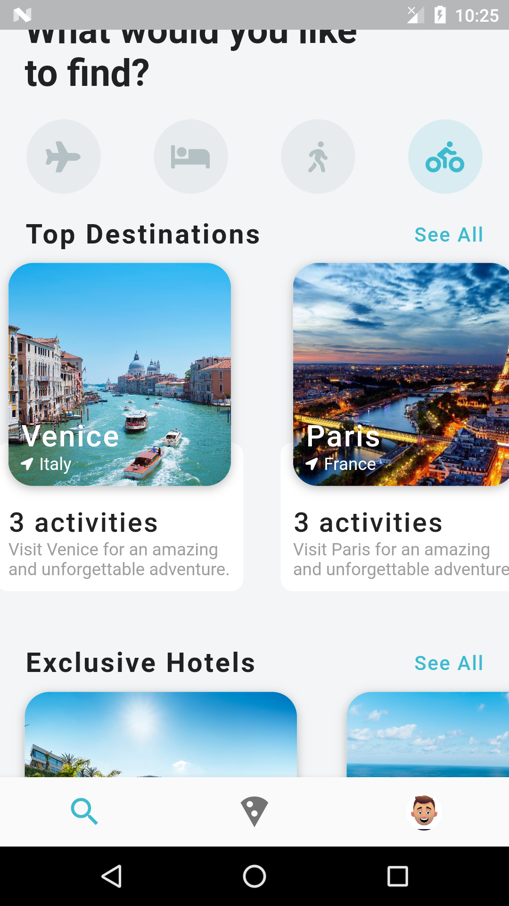
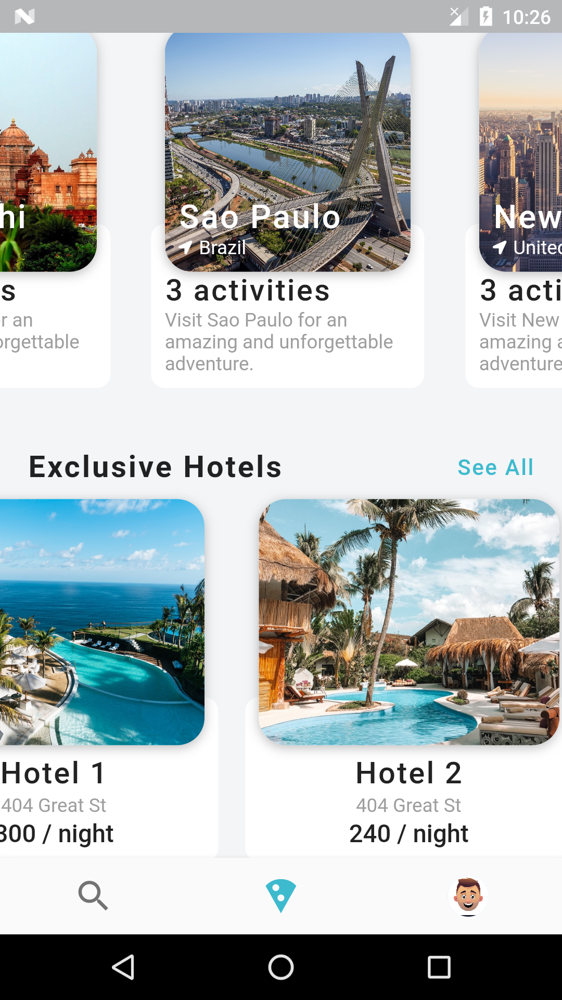
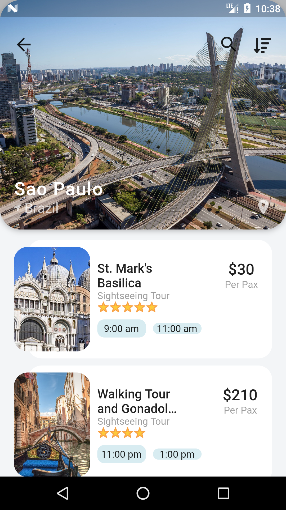
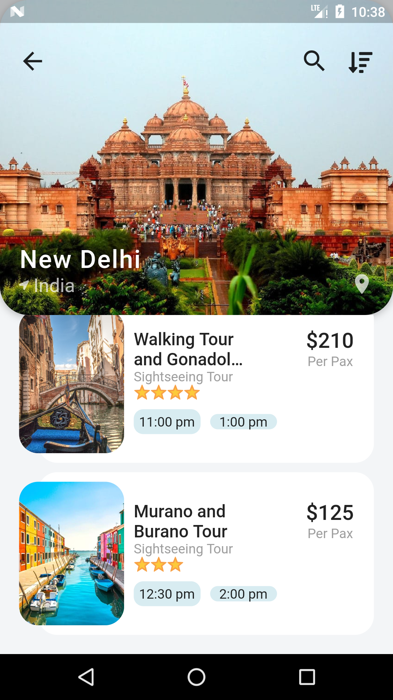

[![Contributors][contributors-shield]][contributors-url]
[![Forks][forks-shield]][forks-url]
[![Stargazers][stars-shield]][stars-url]
[![Issues][issues-shield]][issues-url]
[![MIT License][license-shield]][license-url]
[![LinkedIn][linkedin-shield]][linkedin-url]

<!-- PROJECT LOGO -->
<br />
<p align="center">
  <a href="https://github.com/Droid021/flutter_adventures">
    
  </a>

  <h3 align="center">Flutter Pet Projects</h3>

  <p align="center">
    A collection of hobby|demo|tutorial projects built using flutter for learning purposes
    <br />
    <a href="#"><strong>Explore »</strong></a>
   </p>
</p>

### Installation

1. Clone the repo

```sh
git clone https://github.com/Droid021/flutter_adventures.git
```

2. Change directory to the cloned repo directory

```sh
cd flutter_adventures
```

3. Run the project

```JS
flutter run
```

<!-- USAGE EXAMPLES -->

## Sample Screenshots

<p align="center">
    A simple Demo app showing a travel guide dummy UI. 
    <br />
    <a href="#"><strong>Download the apk and Explore »</strong></a>
   </p>

### Home Screen

 

### Destinations Screen

 

<!-- LICENSE -->

## License

Distributed under the MIT License. See `LICENSE` for more information.

<!-- CONTACT -->

## Contact

Droid - [@darctrac3](https://twitter.com/darctrac3) - vincivenv@gmail.com

Project Link: [Flutter Adventures](https://github.com/Droid021/flutter_adventures)

<!-- MARKDOWN LINKS & IMAGES -->
<!-- https://www.markdownguide.org/basic-syntax/#reference-style-links -->

[contributors-shield]: https://img.shields.io/github/contributors/Droid021/flutter_adventures.svg?style=flat-square
[contributors-url]: https://github.com/Droid021/flutter_adventures/graphs/contributors
[forks-shield]: https://img.shields.io/github/forks/Droid021/flutter_adventures.svg?style=flat-square
[forks-url]: https://github.com/Droid021/flutter_adventures/network/members
[stars-shield]: https://img.shields.io/github/stars/Droid021/flutter_adventures.svg?style=flat-square
[stars-url]: https://github.com/Droid021/flutter_adventures/stargazers
[issues-shield]: https://img.shields.io/github/issues/Droid021/flutter_adventures.svg?style=flat-square
[issues-url]: https://github.com/Droid021/flutter_adventures/issues
[license-shield]: https://img.shields.io/github/license/Droid021/flutter_adventures.svg?style=flat-square
[license-url]: https://github.com/Droid021/flutter_adventures/blob/master/LICENSE.txt
[linkedin-shield]: https://img.shields.io/badge/-LinkedIn-black.svg?style=flat-square&logo=linkedin&colorB=555
[linkedin-url]: https://www.linkedin.com/in/v3nvince
[product-screenshot]: screenshots/travelui1.png
